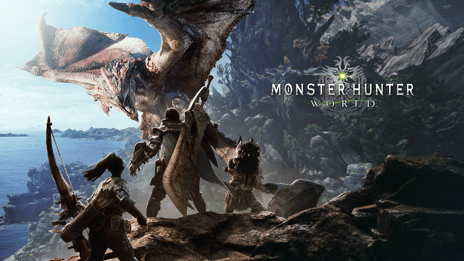
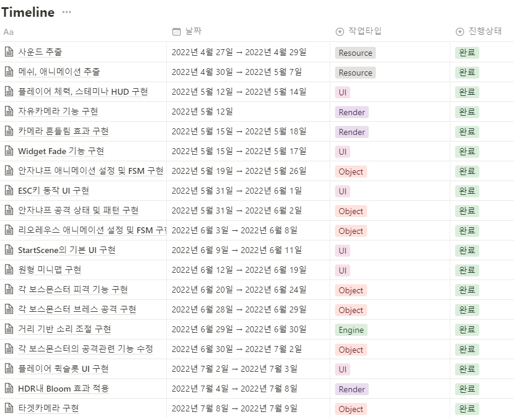

# MH Project

 

# Introduce
#### 개요
* 캡콤에서 개발한 액션 어드벤쳐 게임 ‘몬스터헌터 : 월드’를 DirectX 3D로 모작합니다.
* 본 프로젝트는 약 4개월 간, 총 4명의 팀 작업으로 진행했습니다.
* 프로젝트에서는 몬스터, UI, 후처리를 담당하였습니다.

## Timeline
* [Notion](https://hilarious-trunk-3ab.notion.site/MH-Project-38360d41edb6478ea30b7906b7424556)으로 팀원과 개발 일정을 공유하면서 작업을 진행하였습니다.

 

## Gameplay

